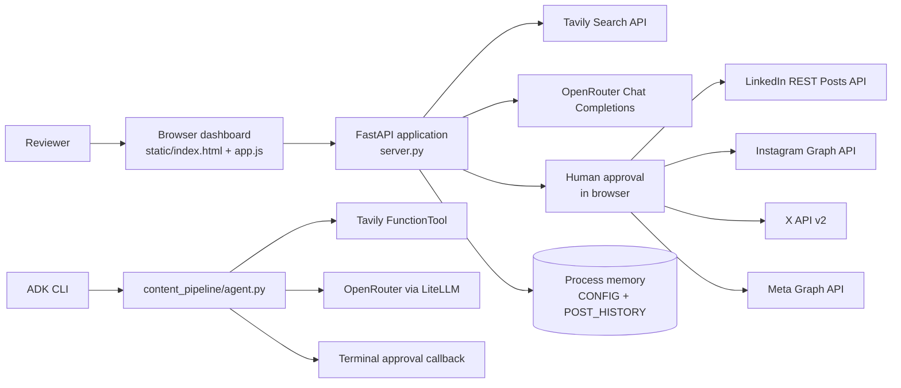
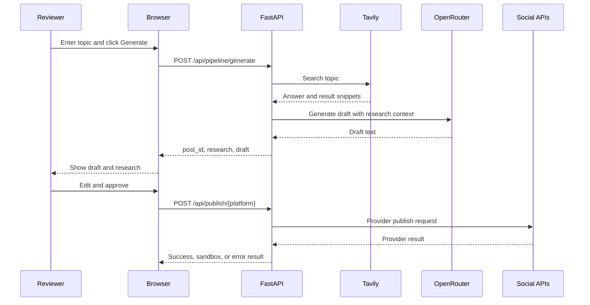
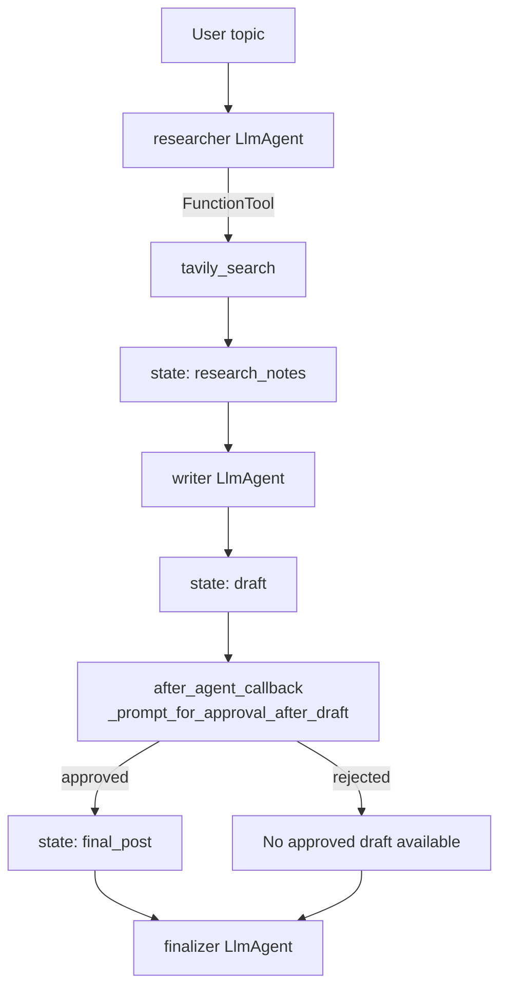

# ContentPulse Architecture and Integration Guide

## 1. System overview

ContentPulse is a human-approved social publishing application. It accepts a topic, gathers current research, generates a draft, lets a reviewer edit or approve the draft, and optionally publishes the approved content to selected social platforms.

The repository currently contains two related execution paths:

1. **Web dashboard path**: `server.py` plus `static/` serves the browser application and exposes the production-oriented HTTP integrations.
2. **Google ADK path**: `content_pipeline/agent.py` defines a standalone sequential agent flow for `adk run content_pipeline`.

These paths share the same product concept and third-party providers, but they do not share the same orchestration code or state store.

## 2. High-level architecture



### Main responsibilities

| Component | Responsibility |
|---|---|
| `server.py` | Loads configuration, serves static files, orchestrates web requests, calls provider APIs, handles OAuth, and keeps process-local history. |
| `static/index.html` | Defines the dashboard layout, controls, editor, approval gate, previews, and settings form. |
| `static/app.js` | Handles browser state, API calls, rendering, platform selection, approval actions, and activity logs. |
| `static/style.css` | Provides the dashboard presentation layer. |
| `content_pipeline/agent.py` | Defines the Google ADK `SequentialAgent` with research, writing, approval, and finalization stages. |
| `requirements.txt` | Declares the Python dependencies for the ADK/provider implementation. |

## 3. Web dashboard request flow

The normal browser flow is:

1. The browser loads `/`, which returns `static/index.html`.
2. The browser loads `/static/app.js` and calls `GET /api/config` to display provider readiness without returning secret values.
3. The reviewer enters a topic, chooses a tone, and selects target channels.
4. `POST /api/pipeline/generate` runs research and draft generation synchronously:
   - `perform_tavily_search()` calls Tavily when `TAVILY_API_KEY` is configured.
   - Without a Tavily key, the server returns a clearly marked synthetic research response.
   - `call_llm()` calls OpenRouter when `OPENROUTER_API_KEY` is configured.
   - Without a key, or when the LLM request fails, the server returns a fallback draft.
   - The generated post is added to `POST_HISTORY` with `pending_approval` status.
5. The browser renders the research and draft in the editor and previews.
6. The reviewer may call `POST /api/pipeline/refine` one or more times to rewrite the draft.
7. The reviewer either approves the draft or rejects it. Approval is currently a browser-side workflow state; the server does not expose a separate approval endpoint.
8. For one-click publishing, the browser sends the approved text concurrently to the selected platform endpoints using `Promise.all()`.
9. Each platform endpoint performs a live API call when credentials are available, otherwise returns a provider-specific simulated or not-configured result.



## 4. Web API surface

### Configuration and OAuth

| Method | Endpoint | Purpose |
|---|---|---|
| `GET` | `/api/config` | Returns provider configuration status and non-secret identifiers. |
| `POST` | `/api/config` | Updates non-empty credentials and identifiers in the process-local `CONFIG` dictionary. |
| `GET` | `/api/x/oauth/start` | Starts X OAuth 2.0 with PKCE and stores temporary state in `OAUTH_SESSIONS`. |
| `GET` | `/api/x/oauth/callback` | Validates the OAuth state, exchanges the code, and stores the X access token in memory. |
| `GET` | `/auth/callback` | Alias for the X OAuth callback. |

### Content pipeline

`POST /api/pipeline/generate`

```json
{
  "topic": "electric bikes for city commuting",
  "tone": "Professional & Engaging",
  "target_platforms": ["linkedin", "instagram", "twitter", "facebook"]
}
```

Returns a generated `post_id`, structured research, draft text, and `pending_approval` status.

`POST /api/pipeline/refine` accepts `current_draft`, `instruction`, and an optional `topic`, then returns `revised_draft`.

### Publishing

| Endpoint | Provider operation |
|---|---|
| `POST /api/publish/linkedin` | LinkedIn REST Posts API, using the configured author URN. |
| `POST /api/publish/instagram` | Instagram Graph API media container creation followed by media publication. |
| `POST /api/publish/twitter` | X API v2 `POST /2/tweets`, using an OAuth 2.0 user access token. Text is capped at 280 characters. |
| `POST /api/publish/facebook` | Meta Graph API Page feed publication, resolving a Page access token when necessary. |
| `GET /api/history` | Returns the current process's in-memory post history. |

Every publisher returns a JSON result containing a status and platform. Live calls generally use `mode: "live"`; LinkedIn and Instagram can return `mode: "simulated_sandbox"` when their credentials are absent. A result with `status: "api_error"`, `"error"`, or `"not_configured"` must be treated as a failed or incomplete publish by clients.

## 5. ADK pipeline integration

`content_pipeline/agent.py` is an independent Google ADK flow:



The ADK stages are:

1. `researcher_agent` uses the Tavily `FunctionTool` and writes concise notes to `research_notes`.
2. `writer_agent` creates a short draft and writes it to `draft`.
3. `_prompt_for_approval_after_draft` asks for `y` or `n` through standard input. This is deterministic and does not depend on model tool calling.
4. `finalizer_agent` returns the approved text from `final_post`, or `No approved draft available.` when the draft was rejected or missing.
5. `content_pipeline_flow` runs these agents in order through `SequentialAgent`; `root_agent` exposes that flow to ADK.

This path does not call the FastAPI publishing endpoints. Its approval result is printed to the terminal rather than sent to LinkedIn, Instagram, X, or Facebook.

## 6. External integrations

### Tavily

- Used for live topic research.
- Web path: direct `requests.post()` from `perform_tavily_search()`.
- ADK path: `tavily_search()` is registered as a Google ADK `FunctionTool`.
- Required variable: `TAVILY_API_KEY`.

### OpenRouter

- Used for draft generation and refinement.
- Web path: OpenAI-compatible `/chat/completions` request via `requests`.
- ADK path: `LiteLlm` configured with an `openrouter/<model>` model name.
- Required variable: `OPENROUTER_API_KEY`.
- Optional variables: `OPENROUTER_MODEL`, `OPENROUTER_API_BASE`.

### Social platforms

- **LinkedIn** requires an access token and author URN. The server posts to `/rest/posts`.
- **Instagram** requires an access token and Instagram account ID. The server creates and publishes a media container.
- **X** requires OAuth 2.0 user authorization. The server uses PKCE and then posts to `/2/tweets`.
- **Facebook** requires a Page access token and preferably a Page ID. The server posts to the Page feed through the Meta Graph API.

## 7. Configuration and state

Configuration is loaded from `content_pipeline/.env` first, then the project-root `.env`. Environment values populate `CONFIG` when `server.py` starts. The settings modal can update the same dictionary at runtime through `POST /api/config`.

Current state is process-local:

- `CONFIG` stores credentials and provider settings.
- `POST_HISTORY` stores generated posts.
- `OAUTH_SESSIONS` stores short-lived X OAuth PKCE state.
- Browser profile fields are stored in `localStorage`.

Restarting the server clears runtime configuration updates, history, OAuth sessions, and access tokens that were not persisted elsewhere. The application is therefore suitable for local demos and single-process use, but it needs a persistent database, encrypted secret store, and shared session storage for multi-user or production deployment.

## 8. Security and operational considerations

- Do not commit `.env` files or place provider secrets in browser code.
- `POST /api/config` currently accepts credentials from the browser and stores them in process memory; add authentication and encrypted persistence before exposing it beyond a trusted local environment.
- Publishing endpoints currently do not authenticate the caller. Add application authentication and authorization before deployment.
- Validate and sanitize provider response data before rendering it. Research links are opened in a new tab and should remain constrained to trusted provider output.
- Add request IDs, structured logs, retry/backoff policies, rate limiting, and timeouts at the application boundary for production use.
- Replace `POST_HISTORY` with durable storage and track each platform publish attempt independently so retries cannot create accidental duplicate posts.
- The web approval action is currently client-controlled. A production approval gate should persist an approval record server-side and require the publisher to verify it.

## 9. Running the project

For the web dashboard from the project root:

```powershell
uvicorn server:app --reload
```

Then open `http://127.0.0.1:8000/`.

For the standalone ADK flow:

```powershell
adk run content_pipeline
```

The required provider keys are `OPENROUTER_API_KEY` and `TAVILY_API_KEY`. Publishing integrations additionally require the platform-specific credentials listed in the configuration section of `server.py`.
